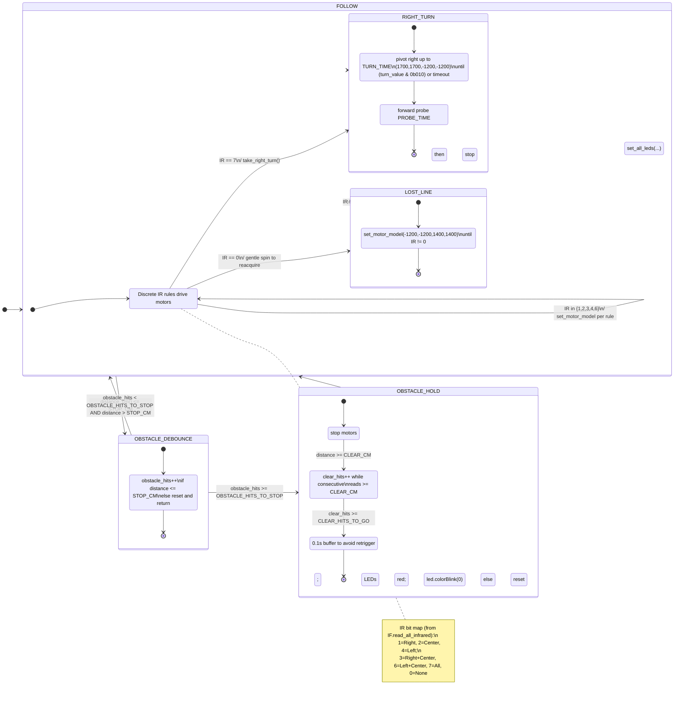

```mermaid
stateDiagram-v2
    direction LR

    [*] --> FOLLOW

    %% ===================== FOLLOW / LINE TRACKING =====================
    state FOLLOW {
        [*] --> TRACK
        TRACK: Discrete IR rules drive motors
        note right of TRACK
          IR bit map (from IF.read_all_infrared):\n          1=Right, 2=Center, 4=Left;\n          3=Right+Center, 6=Left+Center, 7=All, 0=None
        end note

        %% self-loops for normal tracking
        TRACK --> TRACK: IR in {1,2,3,4,6}\n/ set_motor_model per rule; set_all_leds(...)
        TRACK --> RIGHT_TURN: IR == 7\n/ take_right_turn()
        TRACK --> LOST_LINE: IR == 0\n/ gentle spin to reacquire
    }

    %% ===================== LOST-LINE RECOVERY =====================
    state LOST_LINE {
        [*] --> SPIN
        SPIN: set_motor_model(-1200,-1200,1400,1400)\nuntil IR != 0
        SPIN --> [*]
    }
    LOST_LINE --> FOLLOW: IR != 0

    %% ===================== INTERSECTION RIGHT TURN =====================
    state RIGHT_TURN {
        [*] --> PIVOT
        PIVOT: pivot right up to TURN_TIME\n(1700,1700,-1200,-1200)\nuntil (turn_value & 0b010) or timeout
        PIVOT --> PROBE
        PROBE: forward probe PROBE_TIME; then stop
        PROBE --> [*]
    }
    RIGHT_TURN --> FOLLOW

    %% ===================== OBSTACLE STOP WITH HYSTERESIS =====================
    FOLLOW --> OBSTACLE_DEBOUNCE: distance_cm() <= STOP_CM

    state OBSTACLE_DEBOUNCE {
        [*] --> COUNT
        COUNT: obstacle_hits++\nif distance <= STOP_CM\nelse reset and return
        COUNT --> [*]
    }

    OBSTACLE_DEBOUNCE --> OBSTACLE_HOLD: obstacle_hits >= OBSTACLE_HITS_TO_STOP
    OBSTACLE_DEBOUNCE --> FOLLOW: obstacle_hits < OBSTACLE_HITS_TO_STOP AND distance > STOP_CM

    state OBSTACLE_HOLD {
        [*] --> WAIT
        WAIT: stop motors; LEDs red; led.colorBlink(0)
        WAIT --> CLEAR_DEBOUNCE: distance >= CLEAR_CM
        CLEAR_DEBOUNCE: clear_hits++ while consecutive\nreads >= CLEAR_CM; else reset
        CLEAR_DEBOUNCE --> RESUME: clear_hits >= CLEAR_HITS_TO_GO
        RESUME: 0.1s buffer to avoid retrigger
        RESUME --> [*]
    }

    OBSTACLE_HOLD --> FOLLOW

    %% No terminal [*]; loop runs until KeyboardInterrupt
```
